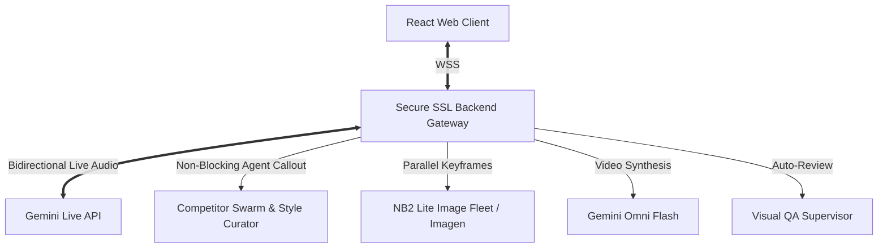

# flow.ad ⚡
> Hyper-localized conversational marketing ad generator powered by Gemini Live and Gemini Omni Flash.

`flow.ad` is a state-of-the-art marketing workspace that lets local business owners create tailored visual and video ad campaigns through a real-time, fluid voice conversation. It integrates ambient local factors (such as weather, events, pricing models, and nearby competitors) into a custom ad design.

---

## 🏗️ Architecture



### 1. Web Client (`/web-client`)
* **Technology**: React + TypeScript + Vite.
* **UI/UX**: Premium dark mode, sleek glassmorphism, responsive live wave visualization, real-time agent log console, and dynamic side-by-side comparison for image and video preview.
* **Protocol**: Secure WebSocket connection to the backend gateway.

### 2. Backend Gateway (`/backend-gateway`)
* **Technology**: Node.js + TypeScript.
* **Security**: Self-signed SSL Certificates for HTTPS/WSS (required for secure microphone access in modern browsers).
* **Gemini SDK**: Uses the new `@google/genai` (v1alpha version of the official Google Gen AI SDK).

---

## 🌟 Core Features

### 🎙️ Bidirectional Audio & Real-time Transcripts
* Establishes a raw, real-time audio pipeline to Gemini Live (`gemini-2.0-flash-exp` / target live model) with `responseModalities: ['AUDIO']`.
* Features full text transcription tracking. By enabling `inputAudioTranscription` and `outputAudioTranscription` in the Live API connect configs, completed speaker turns are extracted dynamically (`msg.inputTranscription` and `msg.outputTranscription`) and displayed clean in the chat area without conversational duplicates.

### 🕵️ Non-Blocking Competitor & Swarm Orchestration
* **Control Plane Swarm**: Background Agents (A-D) crawl local events, check current weather triggers, analyze competitor pricing bounds, and run margin simulations to recommend the best copy strategy.
* **Agent E (Reference Curator)**: Fetches dynamic competitor ad style references based on category, product, and tone.
* **Asynchronous Flow**: Swarm activations and curator fetches run as non-blocking background tasks. The live audio conversation never freezes during tool call execution; context is injected dynamically via `.sendClientContent` once the background swarm completes its sync.

### 🎨 Dynamic Ad Format Elicitation
Before generating any creatives, the agent conversationally prompts you to choose your desired format output:
1. **Still graphic ads only** (1:1 image banner).
2. **Video ads too** (both 1:1 image banner and 9:16 vertical motion video).
3. **Just the cinematic video** (9:16 vertical motion video).

*If you select "Still graphic ads only", the backend skips vertical keyframe rendering and Omni Flash video synthesis, saving compilation time and billing.*

### 🚀 NB2 Lite Image Fleet & Omni Flash Video compilation
* **NB2 Lite / Imagen Failover**: Generates 1:1 square banners and 9:16 portrait storyboard frames in parallel. If `gemini-3.1-flash-lite-image` is unavailable, it gracefully fails over to `imagen-4.0-fast-generate-001`.
* **Gemini Omni Flash**: Synthesizes vertical cinematic video reels (9:16) with vertical motion interpolation starting from the first storyboard frame.
* **Robust Visual QA Supervisor**: Runs an automated audit loop on the final 1:1 banner using `gemini-omni-flash-preview` via the Interactions API to verify text readability, contrast compliance, and product positioning.

---

## 🔑 Environment Configuration

Due to ambient shell conflicts between Google Cloud Application Default Credentials (ADC) and Gemini API Keys, the backend uses a strict custom isolation module (`src/clean-env.ts`).

To configure the project:
1. Create a `.env` file in the `backend-gateway/` directory.
2. Provide your Gemini key:
   ```env
   GEMINI_API_KEY=AIzaSy...
   ```
*Note: The backend automatically filters out conflicting env parameters (such as `GOOGLE_API_KEY`) to ensure `@google/genai` cleanly defaults to your correct workspace API key.*

---

## ⚡ How to Run

### 1. Launch the Backend Gateway
```bash
cd backend-gateway
npm install
npm run start
```
*Served at `https://localhost:50051`. Accept the self-signed certificate in your browser (`https://localhost:50051/public/`) if accessing for the first time.*

### 2. Launch the Web Client
```bash
cd web-client
npm install
npm run dev
```
*Opened at `http://localhost:5173`. Click the Connect button to boot your cold-start conversation.*